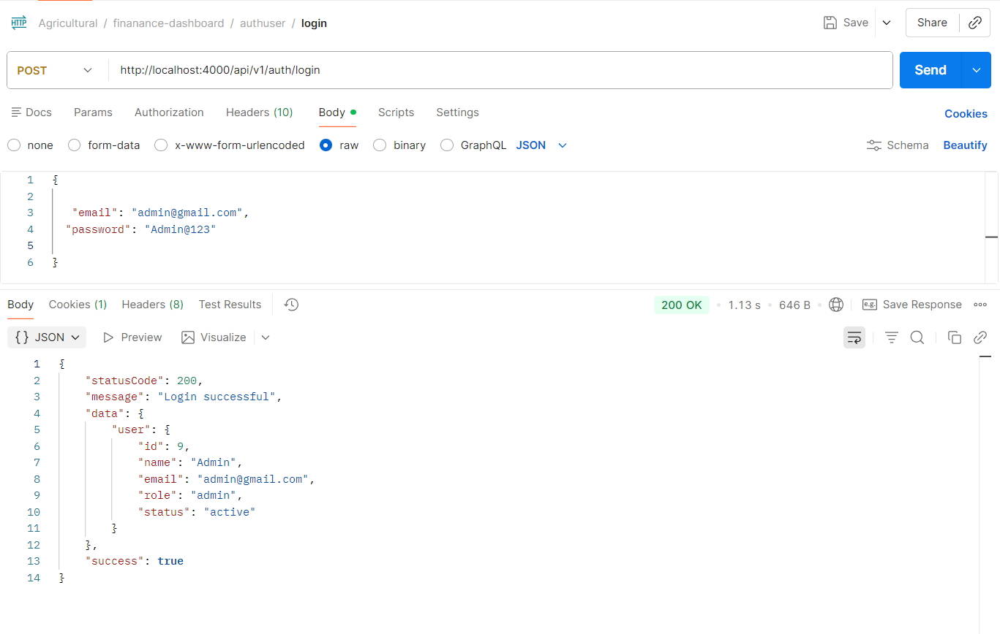
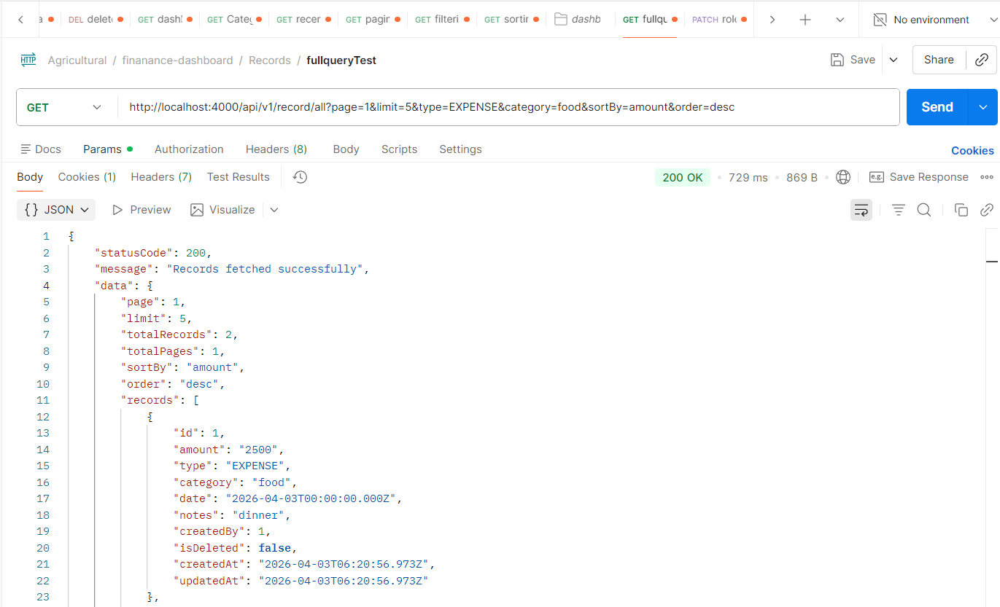
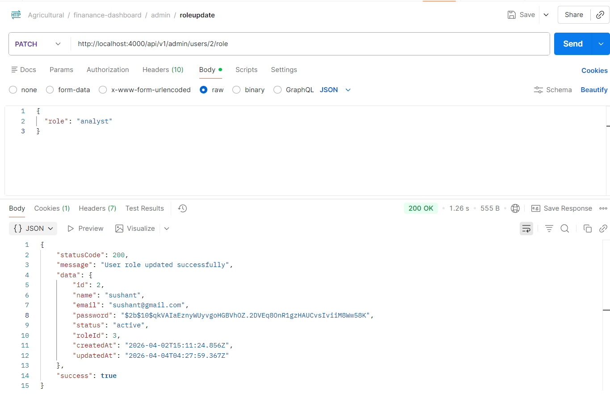

# Finance Data Processing and Access Control Backend

## Overview

This project is a backend system developed as part of a practical assessment to demonstrate backend development skills including **API design, authentication, authorization, validation, business logic implementation, and finance data analytics**.

The system supports secure user authentication, role-based access control, CRUD operations for financial records, dashboard summaries, and advanced querying features like **filtering, pagination, and sorting**.

---

## Tech Stack

* **Node.js**
* **Express.js**
* **Prisma ORM**
* **PostgreSQL**
* **JWT Authentication**
* **Express Validator**

---

## Features

### Authentication & Authorization

* User Registration
* User Login
* User Logout
* JWT-based authentication
* Role-Based Access Control (RBAC)

### Supported Roles

* **Admin**
* **Analyst**
* **Viewer**

### Financial Record Management

* Create single record
* Create multiple records
* Update record
* Delete record (soft delete)
* Fetch all records
* Fetch record by ID

### Advanced Query Features

* Pagination
* Filtering
* Sorting
* Date range filtering

### Dashboard APIs

* Summary analytics
* Category-wise summary
* Recent activity

### Admin APIs

* Update user role

---

## API Endpoints

### Auth Routes

* `POST /api/v1/auth/register`
* `POST /api/v1/auth/login`
* `POST /api/v1/auth/logout`

### Record Routes

* `POST /api/v1/record/create`
* `POST /api/v1/record/create-multiple`
* `PUT /api/v1/record/:id`
* `DELETE /api/v1/record/delete/:id`
* `GET /api/v1/record/all`
* `GET /api/v1/record/:id`

### Dashboard Routes

* `GET /api/v1/dashboard/summary`
* `GET /api/v1/dashboard/category-summary`
* `GET /api/v1/dashboard/recent-activity`

### Admin Routes

* `PATCH /api/v1/admin/users/:id/role`

---

## Query Parameters Supported

Example:

`GET /api/v1/record/all?page=1&limit=5&type=EXPENSE&sortBy=amount&order=desc`

Supported query params:

* `page`
* `limit`
* `type`
* `category`
* `startDate`
* `endDate`
* `sortBy`
* `order`

---

## Project Structure

```text
src/
├── config/
│   └── prisma.js
│
├── controllers/
│   ├── auth.controller.js
│   ├── record.controller.js
│   ├── dashboard.controller.js
│   └── admin.role.js
│
├── middlewares/
│   ├── auth.middleware.js
│   ├── role.middleware.js
│   └── validation.middleware.js
│
├── routes/
│   ├── auth.routes.js
│   ├── record.routes.js
│   ├── dashboard.routes.js
│   └── admin.routes.js
│
├── validators/
│   ├── auth.validator.js
│   ├── record.validator.js
│   └── admin.validator.js
│
├── utils/
│   ├── ApiError.js
│   └── ApiResponse.js
│
├── app.js
└── index.js
```

---

## Setup Instructions

### Install dependencies

```bash
npm install
```

### Setup database

```bash
npx prisma migrate dev
```

### Run server

```bash
npm run dev
```

---

## Environment Variables

Create a `.env` file in the root directory:

```env
PORT=4000
DATABASE_URL=your_postgresql_database_url
JWT_SECRET=your_secret_key
```

You can use `.env.example` as reference.

---

## Test Credentials

### Admin

```text
email: admin@gmail.com
password: Admin@123
```

---

## Screenshots

### Login API Response



### Records API (Pagination + Filtering + Sorting)



### Admin Role Update API



---

## Highlights

This project demonstrates:

* scalable backend architecture
* clean route separation
* middleware-based authentication
* role-based access control
* data processing and analytics
* production-style query handling
* pagination, filtering, and sorting support
* admin role management APIs
